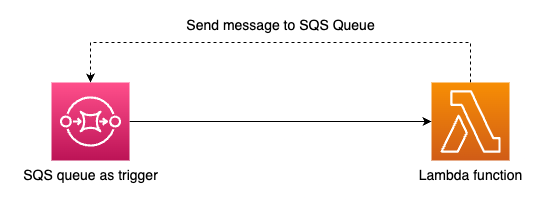

# AWS Lambda recursion test

This project contains the source code of the app that can be used to test AWS Lambda recursion test illustrated in the above diagram.

This can be set up in your own AWS environment with AWS CDK and Python.

For explanation, please refer to this blog post:
https://medium.com/towards-aws/testing-aws-lambda-recursive-loop-detection-5050da5c2c95